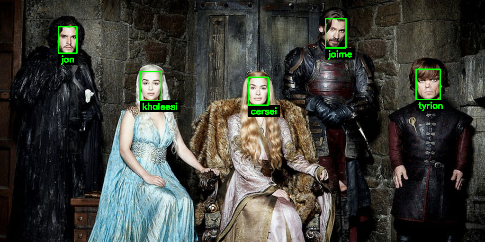
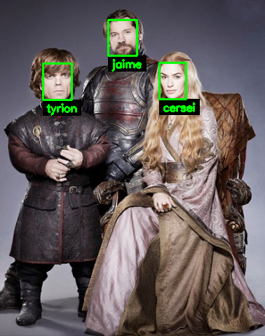

# Face recognition using Pytorch



## Contents 
- [Intro](#Intro)
- [QuickStart](#QuickStart)
- [Train](#Train)
- [Dataset Cleanup](#Dataset-Cleanup)
- [Pre-trained models](#Pre-trained-models)
- [Compatibility](#Compatibility)

## Intro
Face recognition in this repo performed using Pytorch, described in the papers:
- [x] [ArcFace: Additive Angular Margin Loss for Deep Face Recognition](https://arxiv.org/pdf/1801.07698.pdf). (recomended)
- [x] [CosFace: Large Margin Cosine Loss for Deep Face Recognition](https://arxiv.org/pdf/1801.09414.pdf). 
- [x] [A Discriminative Feature Learning Approach for Deep Face Recognition](https://ydwen.github.io/papers/WenECCV16.pdf). 

Face detection on images and live camera performed using Tensorflow MTCNN implementation. [Multi-task CNN](https://kpzhang93.github.io/MTCNN_face_detection_alignment/index.html). 
A OpenCV C++ implementation can be found [here](https://github.com/egcode/mtcnn-opencv)


## QuickStart
```
git clone https://github.com/egcode/facerec.git
cd facerec
```
Install all dependencies from `requirements.txt`.

Download playground datased to `data/dataset_got` folder with command:
```
python3 download_data.py --download_type dataset_got
```
Download pretrained model to `data/pth`:
```
python3 download_data.py --download_type pth
```
Generate dataset `.h5` file where labels and embeddings stored:
```
python3 app/export_embeddings.py \
--model_path ./data/pth/IR_50_MODEL_arcface_ms1celeb_epoch90_lfw9962.pth \
--data_dir ./data/dataset_got/dataset_lanister_raw/ \
--output_dir data/out_embeddings/  \
--model_type IR_50 \
--is_aligned 0 \
--with_demo_images 1 \
--image_size 112 \
--image_batch 5 \
--h5_name dataset_lanister.h5
```
That's it. Now everything is ready to recognize faces from image or live camera.

Face recognition with image:
```
python3 app/face_recognition_on_image.py \
--image_path ./data/dataset_got/test3.jpg \
--model_path ./data/pth/IR_50_MODEL_arcface_ms1celeb_epoch90_lfw9962.pth \
--model_type IR_50 \
--unknown_face unknown \
--max_threshold 0.6 \
--distance_metric 1 \
--font_size 0.5 \
--h5_name ./data/out_embeddings/dataset_lanister.h5
```
Result should be like this image:  



Face recognition with live camera is pretty much the same but just with `face_recognition_live_cam.py` file. Make sure to generate `.h5` file with faces that will be visible on camera. 

## Train
```
git clone https://github.com/egcode/facerec.git
cd facerec
```

Install all dependencies from `requirements.txt` if you haven't already.
Download all required validation datasets:
[LFW](http://vis-www.cs.umass.edu/lfw/), [CALFW](http://www.whdeng.cn/CALFW/index.html?reload=true), [CPLFW](http://www.whdeng.cn/CPLFW/index.html?reload=true), [CFP_FF](http://www.cfpw.io/), [CFP_FP](http://www.cfpw.io/)
and [Casia-Webface](http://www.cbsr.ia.ac.cn/english/CASIA-WebFace-Database.html) dataset:
```
python3 download_data.py --download_type train
```

this command will download all required datasets to `data` folder.
Start training:
```
python3 train.py
```

After training started, make sure `out` folder created in the project root. All logs, saved model points and tensorboard logs are saved here.
To start tensorboard to view training process just run:
```
python3 logger.py
```
and open `http://localhost:6006/` to view training process.


## Dataset Cleanup
```
git clone https://github.com/egcode/facerec.git
cd facerec
```
Install all dependencies from `requirements.txt` if you haven't already.

Download `dataset_got` playground dataset, if you haven't with a command
```
python3 download_data.py --download_type dataset_got
```
After downloading complete, path `data/dataset_got/dataset_targarien_aligned_112_dirty` is the folder that simulates dirty dataset, where images that starts with `DIRT*` represent noise that should be removed.
To cleanup our dataset first we should export embeddings for each image to a `.h5` file.
```
python3 dataset_cleanup/export_dataset_embeddings.py \
./data/pth/IR_50_MODEL_arcface_ms1celeb_epoch90_lfw9962.pth \
./data/dataset_got/dataset_targarien_aligned_112_dirty/ \
--model_type IR_50 \
--image_batch 5 \
--h5_name dataset_targarien_aligned_112_dirty.h5
```

NOTE: If you are using your own images, make sure that all of them are pre-aligned. Use `align_dataset_mtcnn.py` in `.align` folder to align if needed, 

Now we are ready to perform cleanup.
```
python3 dataset_cleanup/cluster_clean_dataset.py \
--affinity cosine \
--linkage average \
--distance_threshold 0.7 \
--h5_name data/dataset_targarien_aligned_112_dirty.h5 \
--output_clean_dataset data/dataset_got/dataset_targarien_112_clean \
--output_failed_images data/dataset_got/dataset_targarien_112_dirt
```
Cluster clean generates two new folders 
`dataset_targarien_112_dirt` - all dirt that was cleaned out.
`dataset_targarien_112_clean` - and new clean dataset without any dirt

If embeddings exported with model that trained with Arface or Cosface `affinity` it is recommended to be `cosine`, if it's Center loss it's `euclidean`. If more information needed about `affinity` or `linkage` it could be found [here](https://scikit-learn.org/stable/modules/generated/sklearn.cluster.AgglomerativeClustering.html) 
Distance threshold cut out images that are too far to form a cluster. Raw representation is in the image below 


****
### Pre-trained models

# Model trained with M1-Celeb

| Download | Training dataset | Architecture |
|-----------------|------------------|-------------|
| [Link](https://drive.google.com/open?id=1itqqp1EWf6sfi0K4i6QYBR_j3NS7gw2i)| M1-Celeb    | [IR_50](https://github.com/egcode/facerec/blob/master/models/irse.py) |

  * Performance
    |LFW|CFP_FF|CFP_FP|CALFW|CPLFW|
    |:---:|:---:|:---:|:---:|:---:|
    |99.62|99.26|90.09|92.65|81.15|

  * Parameters
  ```
    python3 train.py \
    --model_type IR_50 \
    --data_dir ./data/MS_Celeb_1M_112 \
    --batch_size 128 \
    --batch_size_test 128 \
    --evaluate_batch_size 128 \
    --criterion_type arcface \
    --total_loss_type softmax \
    --optimizer_type sgd_bn \
    --margin_s 32.0 \
    --margin_m 0.5 \
    --validation_set_split_ratio 0.0 \
    --lr 0.1 \
    --lr_schedule_steps 30 55 75 \
    --apex_opt_level 2
  ```
  * Training statistics
  
    


NOTE: If you use any of the models here, please do not forget to give proper credit to those providing the training dataset as well.


## Compatibility
The code is tested using Pytorch 1.0 under OSX 10.14.5 and Ubuntu 16.04 with Python 3.6. 

## Inspiration
[InsightFace_Pytorch](https://github.com/TreB1eN/InsightFace_Pytorch)
[Face_Pytorch](https://github.com/wujiyang/Face_Pytorch)
[face.evoLVe.PyTorch](https://github.com/ZhaoJ9014/face.evoLVe.PyTorch)
[facenet](https://github.com/davidsandberg/facenet)
